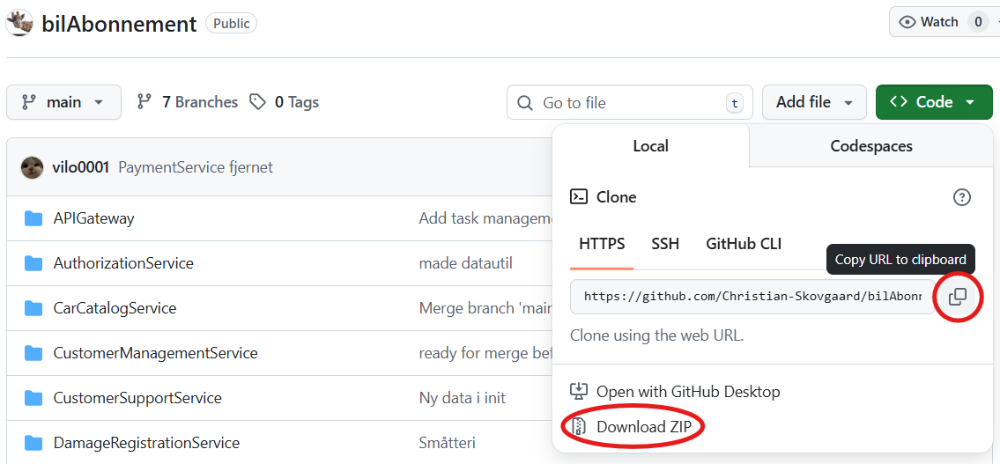
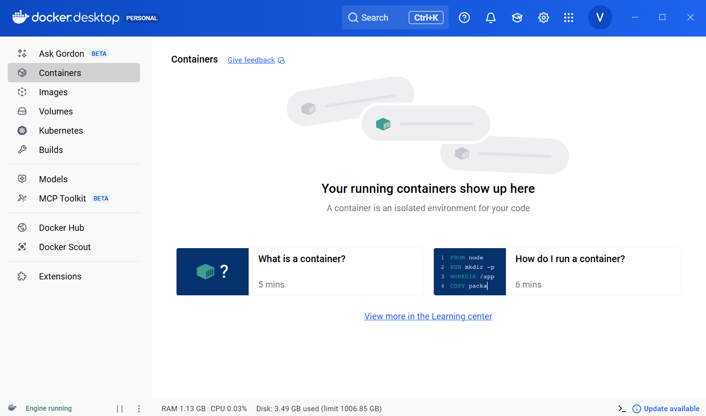
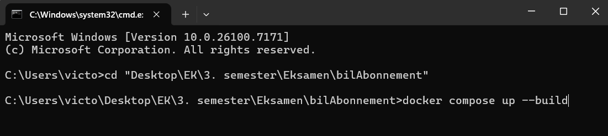
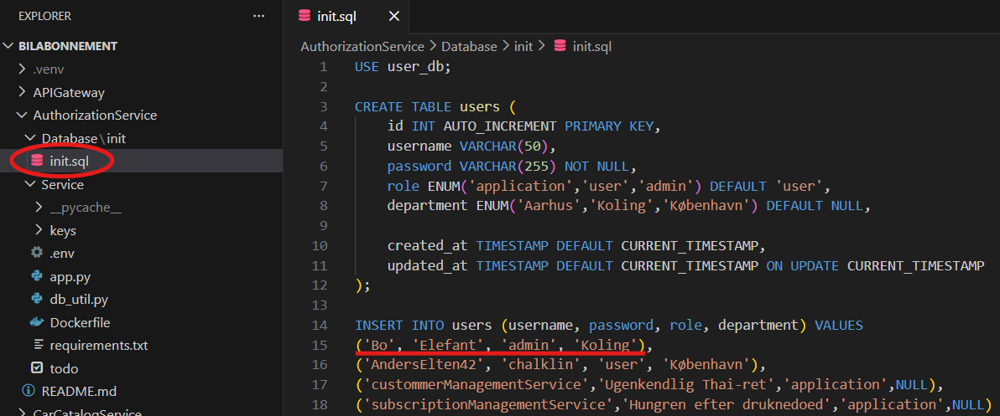
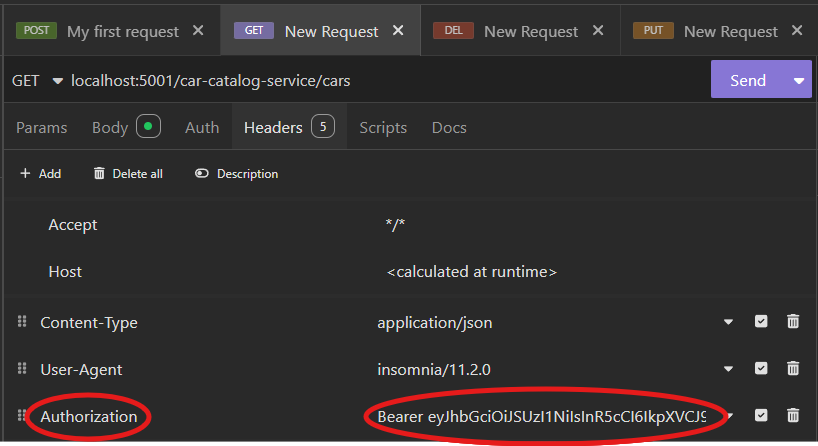

# Bilabonnement.dk | Internal System

## 📋 Description
This project is developed by Team SAFers for the 3rd semester autumn exam 2025 for IT-Architecture at [Business Academy Copenhagen](https://www.ek.dk/english/exchange/ek-guldbergsgade).

The fictive case presented aims to make a system following a microservice architecture to handle internal processes for Bilabonnement.dk to make them more data driven and effective. The system's architecture has been mapped from an analysis based on models and tools presented in the courses Business- and System Development to which microservices have been created for the following processes: car catalog, damage registration, subscription management, authorization, customer management and support, and employee task management.

The system allows employees at Bilabonnement.dk to have a single source of truth which can easily be integrated into their already existing [customer-orienting system](https://www.bilabonnement.dk) to allow for easy automation and minimizing of redundant tasks.

## 💻 How to Install and Run the Project

### 💾 Git Clone or Download ZIP
First you'll need to have the project in a folder on your PC. If you are familiar with Git, you can simply clone the project. In case you are unfamiliar with Git, you can click "Code" (see image below) and then "Download ZIP". When the .zip file has downloaded, remember to unzip it and place it in at your desired destination.

### 🐳 Docker Desktop
To be able to start the system, you'll need Docker Desktop running. [Click here to download Docker Desktop](https://www.docker.com/products/docker-desktop/).

Your Docker Desktop should look something like this:

### ▶️ Starting the Application
When you've got the project folder unzipped at your desired destination and Docker Desktop running, you can now navigate to your project folder in the command prompt and run `docker compose up --build` like so:

Wait about a minute and the system should now be running! 🎉

You should now be able to access the frontend on any browser at [http://localhost:8501/](http://localhost:8501/) and log in with username: `Bo` and password: `Elefant`.

## ❓ How to Use
When you've got the project running in Docker Desktop you should be able to navigate around the frontend on [http://localhost:8501/](http://localhost:8501/) or send requests directly to the API gateway on [http://localhost:5001/](http://localhost:5001/) with software like Postman or Insomnia.

If you wish to send requests, navigate the frontend, or make changes in the code there are two important things to understand which are explained in the following subsections.

### 🔐 Authorizaiton
All endpoints on the API gateway except `getAuthToken` requires a valid JWT in the header of your request. To get a valid JWT you must send a POST-request with valid login credentials to `getAuthToken`. Valid login credentials can get accessed and updated in the `init.sql` file (see picture below).

We would recommend that you use `{"username": "Bo", "password": "Elefant"}` as the body of your POST-request to `localhost:5001/getAuthToken` or as login credentials on the frontend. The response will include a new JWT associated with your login credentials that will be valid for 30 minutes - copy this response into a new header called "Authorization" with the word "Bearer " in front of it for every subsequent request you wish you make.

### 🚦 API Intersection
To combat redundancy in the API gateway, a "request intersection" solution has been made. This means that the microservices' respective endpoints can be accessed adding the given microservice `<service>` and the desired endpoint `<path:path>` in your request.

The microservices are expected to been written as seen on the table below. If you wish to learn about a specific microservice's endpoints, you can visit the README on the desired microservice folder.

| Service | Written as | Endpoints |
| :--- | :--- | :--- |
| Car catalog | car-catalog-service | [README](./CarCatalogService/README.md) |
| Customer support | customer-support-service | [README](./CustomerSupportService/README.md) |
| Authorization | authorization-service | [README](./AuthorizationService/README.md) |
| Damage registration | damage-registration-service | [README](./DamageRegistrationService/README.md) |
| Subscriptions | subscription-management-service | [README](./SubscriptionManagementService/README.md) |
| Customer management | customer-management-service | [README](./CustomerManagementService/README.md) |
| Tasks | task-management-service | [README](./TaskManagementService/README.md) |

This means that a GET-request to Car catalog should look something like this: `localhost:5001/car-catalog-service/cars`

## 🪳 Known Issues
* Sensitive information is sent in clear text
* You are not able to add a new report on the frontend if no damage report is present on a given car
* It is not possible to add new users on the frontend, not even as admin
* The frontend has a lot of redundant code and is generally not easy to read
* Streamlit cookies are very "fragile" and don't save upon closing the browser window or updating the URL

## 📫 Contact
If you're interested to learn more about the project or just have questions in general, feel free to reach out to us at the following email addresses:
* vilo0001 - vilo0001@stud.ek.dk
* Christian-Skovgaard - chni0005@stud.ek.dk
* andreas-brandenborg - anbr0003@stud.ek.dk
* Giemsa-it - magi0002@stud.ek.dk
* AndreasRG - angu0001@stud.ek.dk
